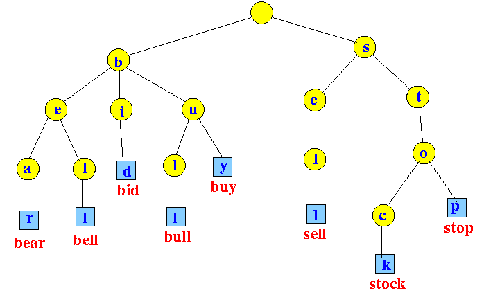
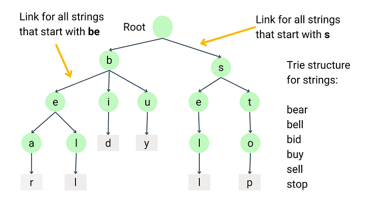

# Spell Checker

This project implements a simple spell checker in Java using a Trie data structure. The spell checker reads a dictionary of words from a file and uses the Trie to suggest corrections for misspelled words.

## Table of Contents

- [Introduction](#introduction)
- [Features](#features)
- [How It Works](#how-it-works)
- [Getting Started](#getting-started)
- [Usage](#usage)
- [Output](#output)
- [Disadvantages](#disadvantages)
- [Future Improvements](#future-improvements)
- [Contributing](#contributing)
- [License](#license)

## Introduction

The Java Spell Checker is a basic spell-checking application designed to identify and suggest corrections for misspelled words. It uses a Trie data structure to efficiently store and retrieve words from a dictionary file.

## Features

- Reads a dictionary of words from a file.
- Uses a Trie data structure to store and search for words.
- Identifies misspelled words in user input.
- Suggests possible corrections for misspelled words based on edit distance.

## How It Works




### Trie Data Structure

The Trie (also known as a prefix tree) is a tree-like data structure that stores strings in a way that allows for efficient prefix-based searches. Each node in the Trie represents a single character of a string, and the path from the root to a node represents a prefix of a string.

### Spell Checker Workflow

1. **Dictionary Loading**: The spell checker reads a dictionary of words from a file and inserts them into a Trie.
2. **User Input**: The user inputs a sentence to be checked for spelling errors.
3. **Spell Checking**: The spell checker identifies misspelled words by checking if each word exists in the Trie.
4. **Suggestions**: For each misspelled word, the spell checker suggests possible corrections based on the edit distance (Levenshtein distance) between the misspelled word and the words in the dictionary.

### Code Functionality

- **Main Method**: The entry point of the application, which initializes the spell checker and handles user input.
- **SpellChecker Class**: Contains methods to check for misspelled words and suggest corrections.
- **Trie Class**: Implements the Trie data structure with methods to insert words, check for word existence, and retrieve all words.
- **TrieNode Class**: Represents a node in the Trie, containing a map of children and a boolean flag indicating if the node is the end of a word.

## Getting Started

### Prerequisites

- Java Development Kit (JDK) installed on your machine.

### Installation

1. Clone the repository:
   ```bash
   git clone https://github.com/MeetkumarChavda/Java-projects.git
   cd Java-projects
   ```

2. Compile the Java files:
   ```bash
   javac *.java
   ```

3. Run the application:
   ```bash
   java SpellCheckerMain
   ```

## Usage

1. Enter a sentence to be checked for spelling errors.
2. The spell checker will identify misspelled words and suggest possible corrections.
3. Enter another sentence or type 'q' to exit the application.

## Output

Check out the sample output in the PDF below:

[PDF file](<Output/SpellChecker output.pdf>)


## Disadvantages

While the current implementation provides a basic spell-checking functionality, it has several limitations:

- **Limited Dictionary**: The spell checker relies on a predefined dictionary, which may not be comprehensive enough to cover all possible words.
- **Basic Suggestion Algorithm**: The current suggestion algorithm based on edit distance is simple and may not always provide the most accurate suggestions.
- **No Contextual Understanding**: The spell checker does not consider the context of the words, which can lead to inaccurate suggestions.
- **Performance**: The Trie data structure and edit distance algorithm may not be optimized for very large dictionaries or real-time applications.
- **Static Dictionary**: The dictionary is static and does not support dynamic updates or additions of new words.


## Future Improvements

While the current implementation provides basic spell-checking functionality, there are several areas for improvement:

- **Advanced Suggestion Algorithms**: Implement more sophisticated algorithms for suggesting corrections, such as n-gram models or machine learning-based approaches.
- **Dictionary Enhancement**: Expand the dictionary to include a more comprehensive list of words.
- **User Interface**: Develop a graphical user interface (GUI) for a more user-friendly experience.
- **Performance Optimization**: Optimize the Trie data structure and spell-checking algorithms for better performance.
- **Real-World Applications**:
  - **Text Editors and Word Processors**: Integrate the spell checker into text editors and word processors to provide real-time spelling suggestions.
  - **Search Engines**: Enhance search engines by suggesting corrections for misspelled search queries, improving user experience and search accuracy.
  - **Email and Messaging Platforms**: Implement spell-checking features in email clients and messaging platforms to ensure professional communication.
  - **Educational Tools**: Use the spell checker in educational software to help students improve their spelling and writing skills.
  - **Customer Support Systems**: Integrate the spell checker into customer support systems to assist agents in providing accurate and professional responses.

### Technologies Used in Real-World Spell Checkers and Suggestors

- **Natural Language Processing (NLP)**: Advanced spell checkers often use NLP techniques to understand the context and provide more accurate suggestions.
- **Machine Learning**: Machine learning models can be trained on large datasets to predict and correct misspelled words more effectively.
- **N-gram Models**: These models analyze sequences of words to predict the likelihood of a word being correct in a given context.
- **Levenshtein Distance**: A common algorithm used to measure the difference between two strings, helping to identify and suggest corrections for misspelled words.
- **Soundex and Metaphone**: Algorithms that convert words to phonetic representations, useful for suggesting corrections based on how words sound.
- **Trie Data Structures**: Efficiently store and retrieve words, making them ideal for spell-checking applications.


## Contributing

Contributions are welcome! Please open an issue or submit a pull request if you have any suggestions or improvements.

## License

This project is licensed under the MIT License. See the [LICENSE](LICENSE) file for details.

---